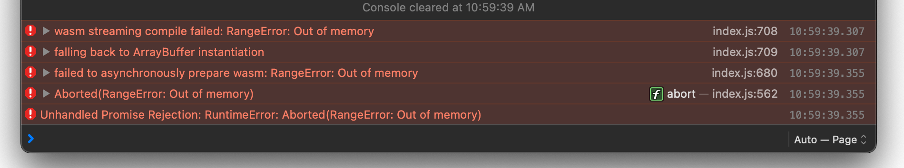

# Reproducer for Safari bug / WASM Out of Memory (not recoverable with reload)

This repository illustrates a bug in Safari on iOS 17.5.1 (and possibly earlier versions as well), where there an out of memory error occurs when loading WebAssembly code.

The bug can be triggered by repeatedly reloading the page. Once the bug appears, the following will be printed to the console:

```
[Error] wasm streaming compile failed: RangeError: Out of memory
	(anonymous function) (index.js:708)
```



Crucially, the out of memory situation persist across reloads, necessitating a browser restart.

This repo contains a file `index.c` which can be compiled to a `index.html/.js/.wasm` output by using the Emscripten toolchain. The Emscripten build invocation is encapsulated in the shell script `build.sh`.

For convenience, the build output is checked in to this repository.
